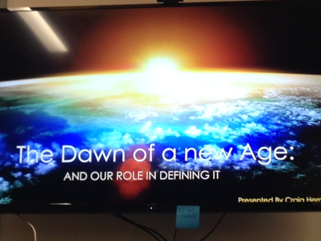
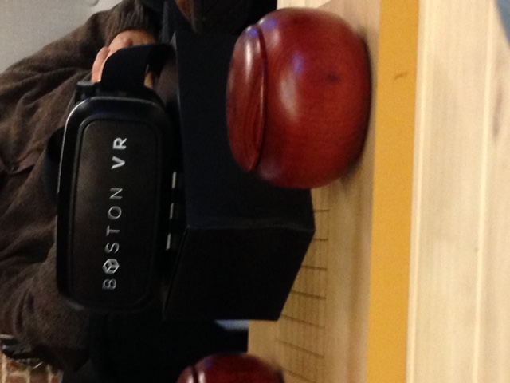
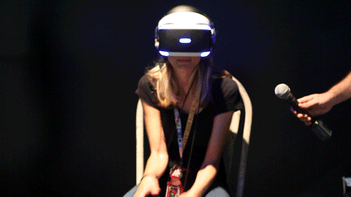
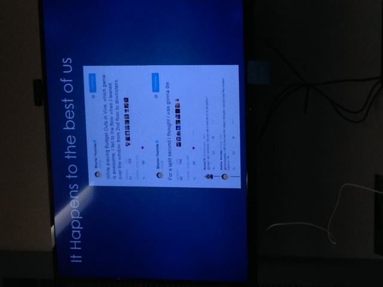

#[Boston VR Unity 3D Meetup](http://bostonvr.org)
##The Dawn of a New Age and Our Role in Defining It

On Thursday April 14th, I attended a meetup where a group of people who were interested in Unity and Virtual Reality were meeting for the first time. Very recently, I've gotten into the idea of Virtual Reality and I figured this would be a great way to insert myself into the community and just start to get to know other people around Boston who are interested in VR.
The meetup was at Dispatch Technologies above the Granary Tavern because one of the members from Boston VR works there and offered up the really awesome, start up place. The organizer of the event was a man named Craig Herndon, who is an active member of Boston VR. He created this meetup to focus mostly on Unity based VR projects as opposed to other engines or businesses explored in Boston VR.
The group that came was mostly men. In fact, besides myself and Jorb, everyone else was a man, which I figured was kind of funny but telling about the gender bias in the gaming industry that tends to happen. But I digress.

I was one of the first people to show up to the meetup, and I was able to have a nice conversation with Craig and two other men who work together at a Unix software company, and we all were able to hit it off and talk about the newest developments in VR. When they asked what I do, and I mentioned how I work mostly on art as opposed to programming and coding, Craig himself said that I don't have to worry about programming in the VR gaming world, at least in Boston, because most people who go to these meetups are looking for artists because they all already know how to coding. So that was exciting to hear.
Jeff Bail from Boston VR came after a little while, and he brought his mobile VR headset, which we passed around while we waited for others to show up. It was the first VR experience I've ever personally had, and it was short, but awesome.

After more people showed up, Craig started his presentation. He talked about gaming and designing for VR in general, and explored what designers need to consider when programming and creating a game in VR, such as:

*	the height of the player and eye tracking
*	do not ruin the trust between creator and player by making something unexpected happen
*	Users bring what they know about the world into your environment
*	make a game designed to be played in short bursts due to motion sickness

He then went on to talk about the immersive elements of VR, and how you know you've created a good VR game when people physically are moving and crouching to immerse themselves into the environment that you've created.

Then he talked about the business of VR, and different businesses that are using Virtual Reality or will start to soon. Some include:

*	Sports, like football
*	The medical profession
*	interior designers
*	architects

He mentioned how if you're in the gaming industry to make money, you've made the wrong decision, because the business is where the money is.

He ended the presentation with ways to get into the VR community and how to start making VR games.

Essentially, because VR is so new, his one main recommendation was "Just do it." Everybody is just now starting to explore Virtual Reality as a medium, so everybody is experimenting.

After the presentation, I spoke to Craig and Jeff, and they both recommended, as an artist just now breaking into the VR world, I should go to Boston VRs meetups. All in all, even though this was a first meeting, it really helped me realize that I want to do something in Virtual Reality someday and that the future is here and it's awesome.